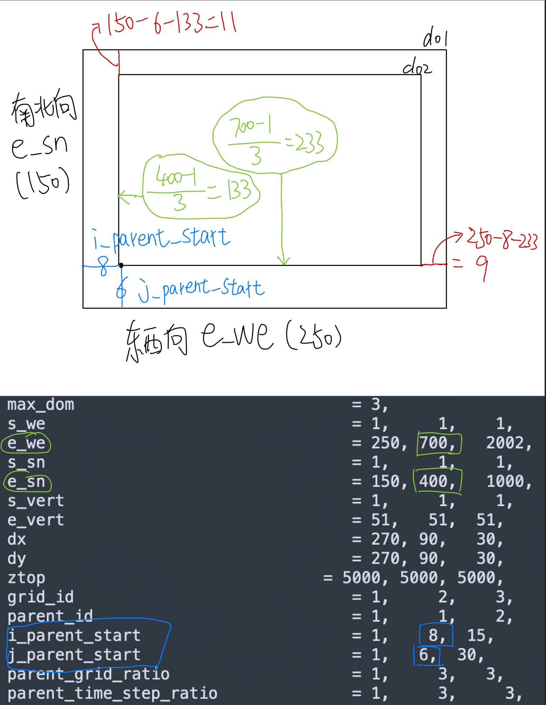

## 1. Installation
### 1.1 Script
Environment:
- OS: Ubuntu 22.04.5 LTS without sudo permission
- Compilers Version: gcc 11.4.0 (system native)

Before installing the libraries, these paths need to be set by adding the following sentence at the end of bashrc. Please note the `DIR` needs to be replaced with the location on your computer.

Installation of LIBRARY like `netcdf`, `zlib`, `libpng`… and compilation of `WRF`
    

if you use this bash for the first time, it’s better to run the script line by line

```jsx
#!/bin/bash
## WRF installation with parallel process.
# Download and install required library for WRF.
# The WRF folder will be under HOME
# Zhipeng Pei <zhipeng.pei@whu.edu.cn>
# Tested in Ubuntu 22.04.5 LTS
# Ctrl+D to comment and Ctrl+shift+D to uncomment line in KATE

## Directory Listing

export HOME=`cd;pwd`
mkdir -p $HOME/WRF
cd $HOME/WRF
mkdir -p Downloads
mkdir -p Library

## Downloading Libraries
cd Downloads
wget -c https://support.hdfgroup.org/ftp/HDF5/releases/hdf5-1.10/hdf5-1.10.5/src/hdf5-1.10.5.tar.gz && echo "hdf5 download done"
wget -c https://downloads.unidata.ucar.edu/netcdf-c/4.9.0/netcdf-c-4.9.0.tar.gz
wget -c https://downloads.unidata.ucar.edu/netcdf-fortran/4.6.0/netcdf-fortran-4.6.0.tar.gz
wget -c https://www2.mmm.ucar.edu/wrf/OnLineTutorial/compile_tutorial/tar_files/jasper-1.900.1.tar.gz
wget -c https://www2.mmm.ucar.edu/wrf/OnLineTutorial/compile_tutorial/tar_files/libpng-1.2.50.tar.gz
wget -c https://github.com/madler/zlib/releases/download/v1.2.13/zlib-1.2.13.tar.gz
wget -c https://download.open-mpi.org/release/open-mpi/v4.1/openmpi-4.1.6.tar.gz
wget -c https://www2.mmm.ucar.edu/wrf/OnLineTutorial/compile_tutorial/tar_files/mpich-3.0.4.tar.gz
echo "All download done"

# Compilers
export DIR=$HOME/WRF/Library
export CC=gcc
export CXX=g++
export FC=gfortran
export F77=gfortran

export JASPERLIB=$DIR/grib2/lib
export JASPERINC=$DIR/grib2/include
export LDFLAGS=-L$DIR/grib2/lib
export CPPFLAGS=-I$DIR/grib2/include

export fallow_argument=-fallow-argument-mismatch
export boz_argument=-fallow-invalid-boz
export FFLAGS="$fallow_argument $boz_argument -m64"
export FCFLAGS="$fallow_argument $boz_argument -m64"

# ## Install NETCDF C Library
# #  --disable-netcdf-4 --disable-shared   is necessary
cd $HOME/WRF/Downloads
tar -xvzf netcdf-c-4.9.0.tar.gz
cd netcdf-c-4.9.0/
make clean
./configure --prefix=$DIR/netcdf --disable-dap --disable-netcdf-4 --disable-shared
make check
make install
export PATH=$DIR/netcdf/bin:$PATH
export NETCDF=$DIR/netcdf

# ## NetCDF fortran library
export LIBS="-lnetcdf -lz"
cd $HOME/WRF/Downloads
tar -xvzf netcdf-fortran-4.6.0.tar.gz
cd netcdf-fortran-4.6.0/
make clean
./configure --prefix=$DIR/netcdf --disable-dap --disable-netcdf-4 --disable-shared
make check
make install
export PATH=$DIR/netcdf/bin:$PATH
export NETCDF=$DIR/netcdf

## openmpi, it will take a lot of time
cd $HOME/WRF/Downloads
tar -xzf openmpi-4.1.6.tar.gz
cd openmpi-4.1.6
make clean
./configure --prefix=$DIR/openmpi
make
make install
export PATH=$DIR/openmpi/bin:$PATH

## MPICH there are some problem in make for my compilation
# cd $HOME/WRF/Downloads
# tar xzvf mpich-3.0.4.tar.gz    #or just .tar if no .gz present
# cd mpich-3.0.4
# ./configure --prefix=$DIR/mpich
# make
# make install
# export PATH=$DIR/mpich/bin:$PATH

# zlib
cd $HOME/WRF/Downloads
tar -xvzf zlib-1.2.13.tar.gz
cd zlib-1.2.13/
make clean
./configure --prefix=$DIR/grib2
make
make install

# # hdf5 library for netcdf4 functionality
# # make check will take a lot of time
# cd $HOME/WRF/Downloads
# tar -xvzf hdf5-1.10.5.tar.gz
# cd hdf5-1.10.5
# make clean
# ./configure --prefix=$DIR --with-zlib=$DIR --enable-hl --enable-fortran
# make check
# make install
#
# export HDF5=$DIR
# export LD_LIBRARY_PATH=$DIR/lib:$LD_LIBRARY_PATH

# # libpng
cd $HOME/WRF/Downloads
tar -xvzf libpng-1.2.50.tar.gz
cd libpng-1.2.50/
make clean
./configure --prefix=$DIR/grib2
make
make install

# # JasPer
cd $HOME/WRF/Downloads
tar -xvzf jasper-1.900.1.tar.gz
cd jasper-1.900.1/
make clean
./configure --prefix=$DIR/grib2
make
make install

## export PATH and LD_LIBRARY_PATH
echo "export PATH=$DIR/bin:$PATH" >> ~/.bashrc
echo "export LD_LIBRARY_PATH=$DIR/lib:$LD_LIBRARY_PATH" >> ~/.bashrc
source ~/.bashrc

# ############################ WRF 4.2.2 #################################
# ## WRF v4.2.2
# ########################################################################
cd $HOME/WRF
git clone https://github.com/wrf-model/WRF
cd WRF
git checkout release-v4.2.2
./clean -a
export NETCDF_classic=1
./configure  # select 34 and 1 for gfortran and distributed memory
./compile em_les >& compile_bash_step_by_step.log
```

Check for errors, there should be nothing on the console. And there should be `ideal.exe` and `wrf.exe` under `WRF/test/em_les` folder

```jsx
cat -n compile_bash_step_by_step.log | grep Error
```

If you want to recompile the WRF on the another console, it’s recommanded add these lines to the `bash_profile` and source it because the variable (like `NETCDF`) is temporary

```jsx
$ gedit ~/.bash_profile

export HOME=`cd;pwd`
export DIR=$HOME/WRF/Library
export CC=gcc
export CXX=g++
export FC=gfortran
export F77=gfortran

export JASPERLIB=$DIR/grib2/lib
export JASPERINC=$DIR/grib2/include
export LDFLAGS=-L$DIR/grib2/lib
export CPPFLAGS=-I$DIR/grib2/include

export fallow_argument=-fallow-argument-mismatch
export boz_argument=-fallow-invalid-boz
export FFLAGS="$fallow_argument $boz_argument -m64"
export FCFLAGS="$fallow_argument $boz_argument -m64"
export NETCDF=$DIR/netcdf
export NETCDF_classic=1

$ source ~/.bash_profile
```
    
### 1.2 Problems
Some of the problems I've had

**Problem 1:**

```
more undefined references to `__module_optional_input_MOD_st_input' follow
collect2: error: ld returned 1 exit status
```

[As WRF forum decribed](https://forum.mmm.ucar.edu/threads/wrf-4-4-build-failure-with-gcc-ubuntu-11-2-0-19ubuntu1.11536/), Using `openmpi` not `MPICH` for Ubuntu 22.04. If you have `sudo` permission, just 

```
sudo apt install libopenmpi-dev libhdf5-openmpi-dev
```

If you don't have sudo permission, install openmpi manually as described in my bash file above.

Check `mpirun`, and it should be

```jsx
$ mpirun --version
mpirun (Open MPI) 4.1.6

Report bugs to http://www.open-mpi.org/community/help/
```

**Problem 2:**

```jsx
************************** W A R N I N G ************************************
NETCDF4 IO features are requested, but this installation of NetCDF           
    /home/zppei/WRF/Library/netcdf
DOES NOT support these IO features.                                          

Please make sure NETCDF version is 4.1.3 or later and was built with         
--enable-netcdf4                                                             

OR set NETCDF_classic variable                                               
    bash/ksh : export NETCDF_classic=1
        echo  csh : setenv NETCDF_classic 1

Then re-run this configure script                                            

!!! configure.wrf has been REMOVED !!!

*****************************************************************************

```


Like the [official wrf guide](https://www2.mmm.ucar.edu/wrf/OnLineTutorial/compilation_tutorial.php), I didn't install hdf5, although you may read in other blogs that hdf installation is important for netcdf installation. I asked ChatGPT and get the answer about hdf5 and netcdf.

In summary, the HDF5 (Hierarchical Data Format 5) library is necessary for NetCDF-4. But we can disable NetCDF-4 support without HDF5 `./configure --disable-netcdf-4`. That's the reason why I get Problem 2. Take easy, just the following command will solve the problem.

`export NETCDF_classic=1`

**Problem 3:**

```jsx
$ cat -n compile_bash_step_by_step.log | grep Error
165	Error: Dummy argument ?datasetname? with INTENT(IN) in variable definition context (actual argument to INTENT = OUT/INOUT) at (1)
173	Error: Rank mismatch between actual argument at (1) and actual argument at (2) (rank-1 and scalar)
178	Error: Type mismatch in argument ?field? at (1); passed INTEGER(4) to REAL(8)
```


[davegill](https://github.com/wrf-model/WRF/issues/1250) suggested use new release of WRF.

```
git clone https://github.com/wrf-model/WRF
cd WRF
git checkout release-v4.2.2
```
        
## 2. Running ideal LES
### 2.1 namelist.input

[Here](https://github.com/zppei97/zppei97.github.io/tree/main/content/post/server-wrf/namelist.input) is an example of my namelist.input

#### 2.1.1 Description
[Here](https://www2.mmm.ucar.edu/wrf/users/namelist_best_prac_wrf.html) is the description of namelist.input from ucar.

#### 2.1.2 Nested domain

#### 2.1.3 Output variables and frequency

According to the [UCAR website](https://www2.mmm.ucar.edu/wrf/users/docs/user_guide_v4/v4.4/users_guide_chap5.html#runtimeio)

- The first step is to create a text file (e.g., my_file_d0X.txt), for each domain, and define the name of that file in the &time_control  section of namelist.input, as indicated below.
```
 &time_control
 iofields_filename               = "myoutfields_d01.txt", "myoutfields_d02.txt","myoutfields_d03.txt"  ! Name of file that tells WRF what to output
 ignore_iofields_warning         = .true.
```
- Contents of the text file associate a stream ID (0 is the default history and input) with a variable, and whether the field is added or removed. Following are a few examples.
```
-:h:0:RAINC,RAINNC
```
removes the fields RAINC and RAINNC from the standard history file.

```
+:h:7:RAINC,RAINNC
```
adds the fields RAINC and RAINNC to an output stream #7, which would create a separate file from the wrfout* files.


- Available options are

  - \+ or -, add or remove a variable
  - 0-24, which stream (integer)
  - i or h, input or history
  - field name in the Registry – this is the first string in quotes.

- If you are interested in outputting variables into a new stream (i.e., not the default history stream 0), then the following namelist variables will also be necessary (example for stream 7):

```
auxhist7_outname = “yourstreamname_d<domain>_<date>”
auxhist7_interval = 360, 360,
frames_per_auxhist7 = 1, 1,
io_form_auxhist7 = 2
```

Here is an example from [Brian Blaylock](https://home.chpc.utah.edu/~u0553130/Brian_Blaylock/tracer.html)

#### 2.1.4 Time_step

According to the [README.namelist](https://github.com/wrf-model/WRF/blob/master/run/README.namelist)

> time step for integration in integer seconds recommend 6*dx (in km) for typical real-data cases

### 2.2 input.sounding
[Here](https://github.com/zppei97/zppei97.github.io/tree/main/content/post/server-wrf/input_sounding) is an example of my input_sounding


### 2.3 How to run model with multi processor


`mpirun -np 6 ./wrf.exe` use 6 logical processors. 

The allocation of these 6 processes can occur on one or multiple physical CPUs, depending on how the scheduler distributes them.

To understand the difference between **CPUs**, **Cores** and **logical processors**: For example, each of your physical **CPUs** has 14 **cores**. If hyper-threading is enabled, each core can run 2 threads, resulting in 28 **logical processors** per physical CPU. Many thanks to ChatGPT :).


If you dont know the number of your CPU/cores, use
```
lscpu
```
to show the information.
### 2.4 Parallel
    
> For your smallest-sized domain: ((e_we)/25) * ((e_sn)/25) = **most** amount of processors you should use
> 
> For your largest-sized domain: ((e_we)/100) * ((e_sn)/100) = **least** amount of processors you should use
>

### 2.3 Problems
**Problem 1: Strange filenames due to colon : in Mac finder**

WRF outputs NetCDF filenames (like `auxhist24_d02_0001-01-01_00:00:00`) that contain timestamps (often including a colon `:`), which on Mac finder systems is an illegal character or causes the filename to be garbled.

you can use the `mv`command to rename a file that contains a colon`:`
```
for file in wrfout*; do
    new_file=$(echo $file | sed 's/:/_/g')
    mv "$file" "$new_file"
done
```

